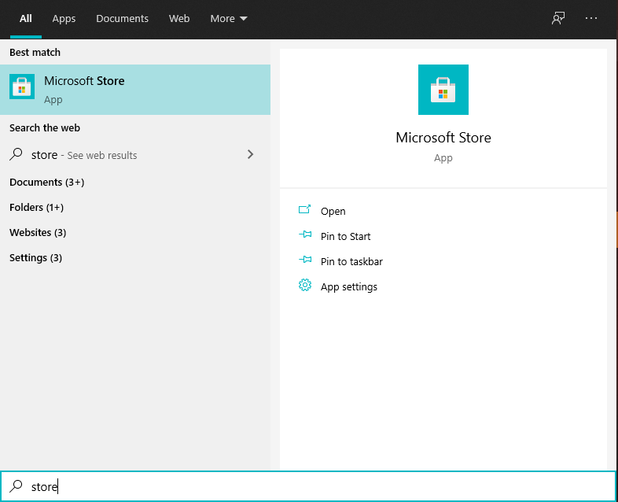
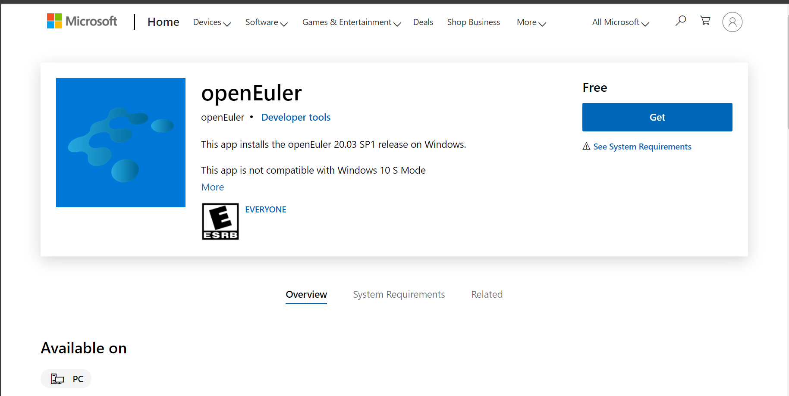

# How to run openEuler on WSL

First you need to configure the WSL environment in 5 steps, and then you can install any WSL distribution from the Microsoft Store, including openEuler!

# Configure the WSL environment  

This is the official docs,  [Install WSL on Windows 10 | Microsoft Docs](https://docs.microsoft.com/en-us/windows/wsl/install-win10), You can also follow these steps:

## 1 Run PowerShell

To open Poweshell by administrator , you can press Win+X and click **Windows PowerShell (Administrator)**

请注意，请不要点击“Windows PowerShell”，一定要点击带有(管理员)后缀的，因为这样才能用管理员身份启动。

Attention please, don't click on Windows PowerShell, be sure to click on the one with (administrator) suffix, because this will launch as an administrator.

Copy and paste the following commands into the console and press Enter to run:

## 2 Enable the Windows Subsystem for Linux

```powershell
dism.exe /online /enable-feature /featurename:Microsoft-Windows-Subsystem-Linux /all /norestart
```

## 3 Enable Virtual Machine feature

```shell
dism.exe /online /enable-feature /featurename:VirtualMachinePlatform /all /norestart
```

## 4 Restart your computer 

Be sure to restart, or you will not be able to continue.

You can bookmark the document page in your browser, so your will find this document after reboot easily.

## 5  Download the Linux kernel update package

Download the [latest package](https://wslstorestorage.blob.core.windows.net/wslblob/wsl_update_x64.msi). Double-click to run - you will be prompted for elevated permissions, select ‘yes’ to approve this installation.

## 6 Set WSL 2 as your default version

Open PowerShell and run this command to set WSL 2 as the default version when installing a new Linux distribution:

```shell
wsl --set-default-version 2
```

# Install openEuler

Once you've done all above, you can go to the Microsoft Store and install any Linux distribution, like openEuler.

1. click [openEuler in Microsoft Store](https://www.microsoft.com/store/apps/9NGF0Q0XP03D), click get, accept jumping to Microsoft Store.

2. Or open the Microsoft Store manually and search for openeuler, as shown below:

By default, your taskbar should have the following ICONS:


If not, you can press Win+Q and search for Microsoft Store



Either way, you'll see the OpenEuler description page on the Microsoft Store, as shown below, click Get and wait for the installation.



# Launch openEuler

Once installed, there are several launch methods:

1. Click the icon in the Start menu.
2. Launch from command line.
3. Launch from VS code.

## Click the icon in the Start menu


As shown in the figure, drag the small openEuler icon on the left to the right to become a larger tile. Click on either the tile or the small icon to run.

## Launch from command line

There are three command lines under Windows: Poweshell, cmd, and Windows Terminal.

Windows Terminal is recommended, which is more in line with the habits of Linux and has a more beautiful interface.

Now I will show you how to install windows terminal, and how to use it.

1. Open Microsoft Store, search for Windows Terminal, and install.
2. Open Windows Terminal in the Start menu or Win+Q search for Windows Terminal.
3. Or press Win+R, type Windows Terminal or its abbreviation wt, and press Enter to launch

After starting any of the three command lines above, you can start openEuler by typing the WSL command on the command line.

Enter the following commands to get command line help:

```
wsl -h
```

Enter the following command to display the currently installed WSL distribution:

```
wsl -l
```


You can see that I have installed openEuler fedoraremix Ubuntu here, and openEuler is the default distribution.

To start the default distribution, enter the following command.

```
wsl 
```

If you installed another WSL distribution before openEuler, you can run the following command to set openEuler to be the default distribution.

```
wsl -s openEuler
```

In addition, you can specify to start any distribution using the -d command.

```
wsl -d openEuler
```


As shown in the figure above, I used Windows Terminal to launch the default distribution of WSL, which is openEuler.


## Launch from VS code

If you want to write some code, I recommend VS code to open WSL.

VS Code can use SSH to connect to WSL. It needs to download an installation package in the WSL, which needs to be unpacked using tar, so the WSL distribution needs tar installed. 

1. Using the methods described above, open openEuler from the command line and install tar.

   ```
   dnf install tar -y
   ```

2. Install VS code, [Visual Studio Code - Code Editing. Redefined](https://code.visualstudio.com/)

3. Open VS Code and install the WSL plug-in.


2. In the Remote Explorer, click the drop-down button and select WSL Targets


3. In the menu, select openEuler to open a new window to start openEuler.

   

4. In VS Code, press the shortcut Ctrl+~ to open the console

# startup interface

Installation is required for the first run, which requires waiting for one or two minutes, as shown in the figure below:


After installation, the interface is as follows:


# Notes

## WSL is not compatible with VMware VirtualBox

Refer to [FAQ's about Windows Subsystem for Linux 2 | Microsoft Docs](https://docs.microsoft.com/en-us/windows/wsl/wsl2-faq#will-i-be-able-to-run-wsl-2-and-other-3rd-party-virtualization-tools-such-as-vmware--or-virtualbox-), WSL uses Hyper-V technology to provide virtualization, and some older versions of VMware and VirtualBox do not work properly when Hyper-V technology is enabled.

This means that you need to update VMware, VirtualBox to the new version to fix the problem.

## VS Code failed to connect to openEulelr

If you use VS Code to connect to openEulelr and get an error like the one shown in the image below, you will need to install tar in openEulelr for VS Code to connect.

Start openEulelr from the command line, and then run the following command to install the tar package.

```shell
dnf install tar -y
```


## Other problems

If you encounter other problems during the installation process, please refer to the following Microsoft documentation:

1. [Install WSL on Windows 10 | Microsoft Docs](https://docs.microsoft.com/en-us/windows/wsl/install-win10#troubleshooting-installation)
2. [Troubleshooting Windows Subsystem for Linux | Microsoft Docs](https://docs.microsoft.com/en-us/windows/wsl/troubleshooting)

In addition, Microsoft also introduced more useful knowledge about WSL, please refer to the documentation:

[Windows Subsystem for Linux Documentation | Microsoft Docs](https://docs.microsoft.com/en-us/windows/wsl/)

## The defect of WSL  

WSL has some unsupported native Linux features, such as systemctl not supported, GUI is being supported, and so on.

Please refer to [FAQ's about Windows Subsystem for Linux 2 | Microsoft Docs](https://docs.microsoft.com/en-us/windows/wsl/wsl2-faq) 

# Porting process

If you are interested in the porting process, you can check out my [porting process](./porting process.md)

