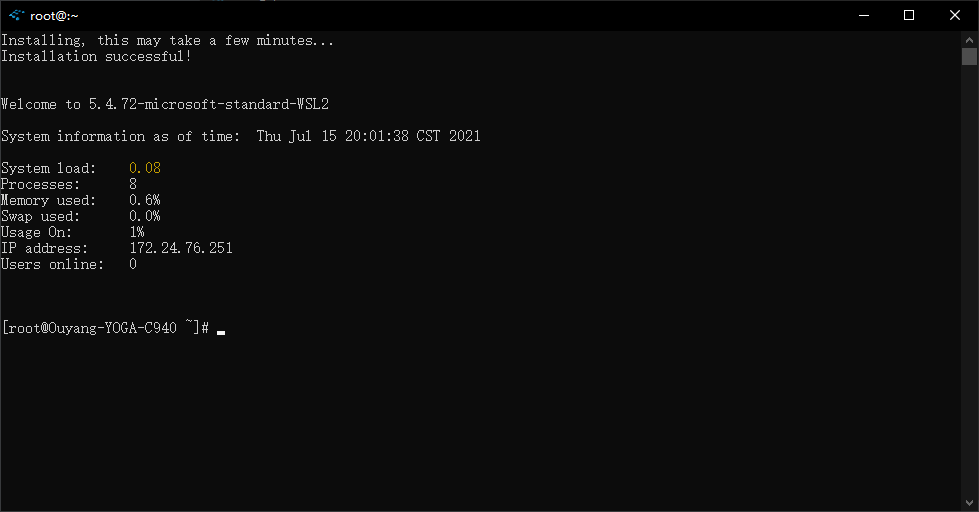
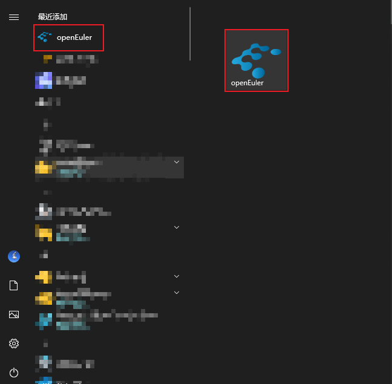
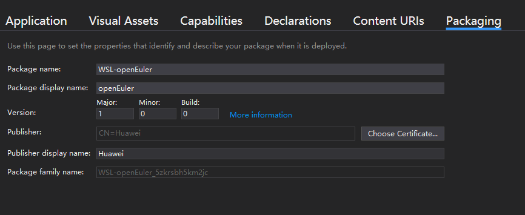
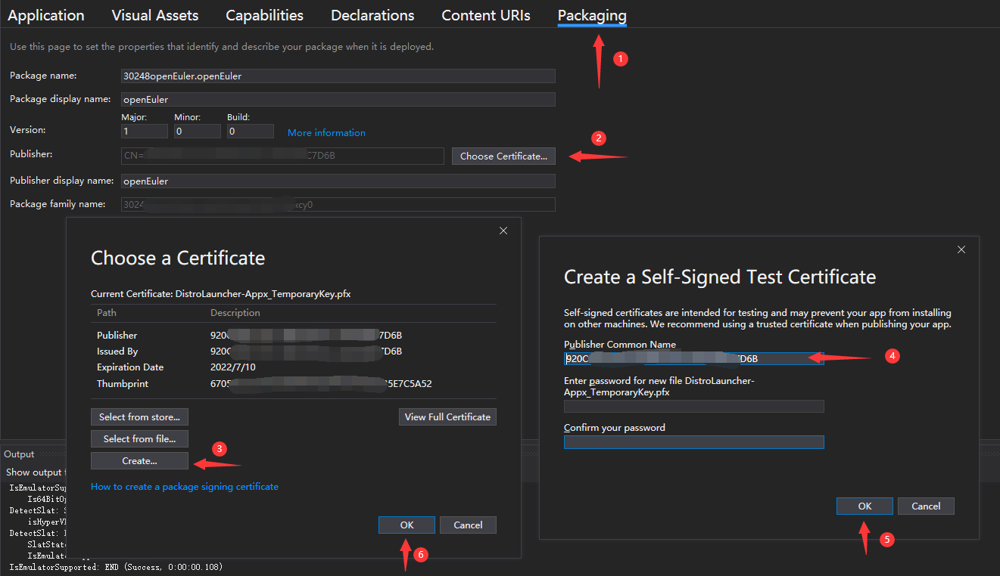

[toc]

# 运行openEuler in WSL

## 配置Windows环境

你需要在Windows上，启用WSL。

这是[微软的配置文档](https://docs.microsoft.com/en-us/windows/wsl/install-win10)，你也可以按照以下步骤来做：

使用管理员身份打开PoweShell或者cmd，有以下两种方式：

1. 按下Win+Q，搜索PoweShell，点击“以管理员身份运行”。

2. 按下Win+R，输入PoweShell或cmd，然后按下Ctrl+Shift+Enter，这样能使用管理员权限启动。

然后复制粘贴下列命令，按回车运行：

1. 开启WSL服务。

```powershell
dism.exe /online /enable-feature /featurename:Microsoft-Windows-Subsystem-Linux /all /norestart
```

2. 开启虚拟机特性。

```shell
dism.exe /online /enable-feature /featurename:VirtualMachinePlatform /all /norestart
```

3. 下载[64位的Linux内核升级包](https://wslstorestorage.blob.core.windows.net/wslblob/wsl_update_x64.msi)，双击点击运行，需要管理员权限。
4. 将WSL2设为默认启动版本。

```shell
wsl --set-default-version 2
```

## 在Microsoft Store上安装openEuler

1. 点击[这个直达链接](ms-windows-store://pdp/?productid=9NGF0Q0XP03D)，单击get，等待安装。

2. 或者打开Microsoft Sore，手动搜索openEuler，如下所示：

默认情况下，您的任务栏应当有下列图标：


如果没有，可以按下Win+Q，输入store，搜索Microsoft store


安装好后，在商城中点击Launch，或在开始菜单中点击openEuler，会进行首次安装。

首次运行需要进行安装，需要稍等一两分钟，如下图所示：


安装好后，界面如下：



## 启动openEuler

安装好后，有以下几种启动方法：

1. 开始菜单中点击图标启动。
2. 命令行启动。
3. VScode中启动。

### 开始菜单中点击图标启动



如图所示，将左侧openEuler小图标拖到右侧变成较大的磁贴，点击磁贴或小图标都能运行。

### 命令行启动

Windows下有三种命令行，PoweShell，cmd，Windows terminal。

推荐使用Windows terminal，其使用更符合linux习惯，而且界面更美观。

前2个命令行打开方式如上所述，下面演示Windows terminal安装打开方式。

1. 打开Microsoft Store，搜索Windows terminal，安装
   2. 在开始菜单或Win+Q搜索windows terminal打开Windows terminal
   2. 或按下Ctrl+R，输入windows terminal或者其缩写wt，按下回车即可启动

启动上述三种任意命令行后，即可在命令行中输入WSL命令，来启动openEuler。

输入下列命令查看帮助：

```
wsl -h
```

输入以下命令显示当前安装的WSL发行版：

```
wsl -l
```


可以看到我这里安装了openEuler、fedoraremix、Ubuntu，且openEuler是默认启动的发行版。

输入下列命令，可以启动默认的发行版。

```
wsl 
```

如果你在安装openEuler前安装了其他WSL发行版，那么可以运行下列命令将openEuler设为默认启动的发行版。

```
wsl -s openEuler
```

此外，使用-d命令，可以指定启动任意发行版。

```
wsl -d openEuler
```


### VScode启动

如果涉及代码编写，推荐使用VScode打开WSL。

VScode可以使用ssh的方式，连接到WSL。其需要在WSL中下载一个安装包，此安装包需要使用tar解包，因此连接的发行版需要安装tar。

1. 使用命令行打开openEuler，确保安装了tar。

   ```
   dnf install tar -y
   ```

2. 在Windows下安装VScode，[官网链接](https://code.visualstudio.com/)。

3. 打开vscode，安装WSL插件。


2. 在远程资源管理器中，在下拉菜单中，选择WSL targets


3. 在菜单中，选择openEuler，即可打开新的窗口启动openEuler

   

   4. 在VScode中，按下快捷键Ctrl+~，即可打开控制台

## 注意事项

### WSL与VMware、VirtualBox不兼容问题

参见[官方文档](https://docs.microsoft.com/en-us/windows/wsl/wsl2-faq#will-i-be-able-to-run-wsl-2-and-other-3rd-party-virtualization-tools-such-as-vmware--or-virtualbox-)，WSL使用Hyper-V技术来提供虚拟化，而部分老版本的VMware、VirtualBox在Hyper-V技术开启后，无法正常运行。

这意味着你需要更新VMware、VirtualBox到新版本来解决这个问题。

### VScode连接openEuler失败

如果你出现了下图所示，那么查看报错信息可以发现，你没有安装tar。

请使用命令行启动openEuler，然后运行下列命令来安装tar包。

```shell
dnf install tar -y
```


### WSL的缺陷

WSL有部分无法支持的原生Linux功能，比如不支持systemctl，正在支持GUI等。

详见[FAQ's about Windows Subsystem for Linux | Microsoft Docs](https://docs.microsoft.com/en-us/windows/wsl/faq#can-i-run-all-linux-apps-in-wsl-)。

# 开发过程

**如果你只想运行openEuler，那么可以到此为止了，不用往下看了。**

如果你对WSL以及移植过程感兴趣，你可以接着往下看。

## 浅谈WSL原理

WSL很多地方与docker很像，如：

1. 启动WSL的速度与启动docker容器速度差不多。
2. 导入导出方式，都是用export，import命令。
3. WSL下的各个发行版，与docker下的容器，都共享宿主机的内核。

因此我简单的理解为，WSL就是一个，使用起来和docker很像的，轻量化的虚拟机。

除此以外，Windows也开发了很多独有技术来实现WSL，参见[官方博客](https://devblogs.microsoft.com/commandline/learn-about-windows-console-and-windows-subsystem-for-linux-wsl/#deep-dives)。

## 手动导入openEuler

[参考官方文档](https://docs.microsoft.com/en-us/windows/wsl/use-custom-distro)，你可以导入任何Linux发行版到WSL内。

1. 你需要获得一个根文件系统，包含openEuler的所有二进制文件。
   1. 使用docker导出容器文件系统。
   2. 或者使用类似debootstrap的工具制作根文件系统。
2. 使用WSL命令导入根文件系统。

### 使用docker导出容器文件系统

[参考文档](https://docs.microsoft.com/en-us/windows/wsl/use-custom-distro)：

1. 下载openEuler LTS SP1的docker镜像，[链接](https://repo.openeuler.org/openEuler-20.03-LTS-SP1/docker_img/x86_64/openEuler-docker.x86_64.tar.xz)，这里将其存放在D:\Download目录下。

2. 打开控制台，**进入刚刚下载镜像的文件夹**，启动Ubuntu，此时Ubuntu的工作目录应在D:\Download目录下。

```shell
cd D:\Download
wsl -d Ubuntu
```

3. 安装Ubuntu下的docker。

```shell
curl -sSL https://get.daocloud.io/docker | sh
```

4. 导入镜像，-i表示使用tar包来导入镜像。

```shell
docker load -i .\openEuler-docker.x86_64.tar.xz
```

5. 查看现有images。

```shell
docker images
```

应该会有以下输出：

```shell
REPOSITORY                 TAG       IMAGE ID       CREATED         SIZE
openeuler-20.03-lts-sp1    latest    6934cec25f28   3 months ago    512MB
```

6. 随便运行一个命令，加载容器。

```sh
docker run openeuler-20.03-lts-sp1 echo hello, openEuler WSL
```

7. 导出docker容器的快照，即当前文件系统。

docker ps -ql表示获得最近运行的容器的编号，即刚才openEuler的容器编号。

```shell
docker export $(docker ps -ql) > ./openEuler.tar
exit
```

### 使用WSL命令导入根文件系统

退出Ubuntu，在控制台使用WSL命令，导入openEuler包，并指明openEuler的安装目录。

举例，设置D:\work\WSL\openEuler为WSL的安装目录。

```shell
wsl --import openEuler D:\work\WSL\openEuler .\openEuler.tar
```

9. 即可启动openEuler。

```shell
wsl -d openEuler
```

### 使用debootstrap导出根文件系统

请注意，debootstrap适用于Debian系操作系统，如Debian、Ubuntu。

febootstrap适用于Fedora操作系统。

如果不使用debootstrap这类工具，可以使用脚本导出根文件系统，下面给出参考链接：

Fedora：[fedora-wsl-builder.sh · master · Gerard Braad / fedora-wsl · GitLab](https://gitlab.com/gbraad/fedora-wsl/-/blob/master/fedora-wsl-builder.sh)

Kali Linux：[build_chroot.sh · master · Kali Linux / Build-Scripts / kali-wsl-chroot · GitLab](https://gitlab.com/kalilinux/build-scripts/kali-wsl-chroot/-/blob/master/build_chroot.sh)


## 构建安装包过程

### 构建安装包的大概过程

1. 克隆，修改启动器基本信息。
2. 安装WSL、WSL下的Ubuntu。
3. 导出根文件系统。
4. 构建包。

### 克隆，修改基本信息

克隆官方启动器仓库。

```shell
git clone https://github.com/Microsoft/WSL-DistroLauncher
```

安装Visual Studio，选择安装“通用Windows平台开发”、“使用C++的桌面开发”工具。

对于“通用Windows平台开发”，需要勾选Windows 10 SDK (10.0.16299.0)，其余默认即可。

使用Visual Studio打开WSL-DistroLauncher工程下的**DistroLauncher.sln。**

双击打开MyDistro.appxmanifest，此时VS会自动探测xml格式，并出现很好看的修改界面如下。



如果您没有在解决方案选项卡中打开MyDistro.appxmanifest，VS将会展现给您全文本的界面。请点击下面的切换按钮，进入解决方案视图，然后双击点击DistroLauncher.sln。


点击Packaging选项卡，点击Choose Certificate...，点击Create...，这里输入Publish Name，如果只是为了测试，这里可以随意输入，如果发布，需要输入你在微软合作伙伴账户的CN码，后续发布流程中会讲到。

修改Application选项卡下的基本信息，修改Visual Asserts图片信息。

不同大小图片可以使用Asserts Generator，给定一个图片，可以生成不同大小的图片。

官网的logo太小，我找到了部门里的logo矢量图.ai文件，放大了些，并参考Ubuntu启动图标，裁剪了文字部分，只保留了logo，尽量让产生的logo在启动界面好看一些。

最后生成的所有图片可以在工程文件中找到。

### 安装WSL、Ubuntu

[参考配置环境这一节](# 配置Windows环境)

### 导出根文件系统

[参考手动导入一节](# 手动导入openEuler)

其中，最后一步改为：即修改了导出包的名称。

```shell
docker export $(docker ps -ql) > ./install.tar
```

退出WSL下的Ubuntu，压缩刚才的包，得到install.tar.gz。

```shell
exit
gzip.exe -k .\install.tar
```

-k表示保留包，不删除。

### 构建包

将install.tar.gz复制到项目的根目录下的x86目录。

使用Visual Studio打开WSL-DistroLauncher工程下的DistroLauncher.sln。

在右侧的Solution Explorer，可以看到以下界面。


右键点击"Solution (DistroLauncher)"，在弹出菜单中点击Deploy Solution。

等待编译完成后，则构建完成，这时应该会在开始菜单安装好测试用的openEuler版本。

此外还可以在.\x64\Debug\DistroLauncher-Appx\AppX文件夹下看到openEuler.exe文件。

## 发布流程

### 账号申请

登录[微软合作伙伴](https://partner.microsoft.com/)账户，注册一个账户

注意，如果选择注册公司账户，需要提供公司注册的官方PDF文件，且微软验证文件的过程将十分漫长。

注册好账户，付款后，登录账户，点击右上角齿轮，点击Account settings，在Windows publisher ID右侧，找到CN开头的码。

这个CN码是用于唯一标识你的账号的，后续打包时要用到。

### 关联APP

在Visual Studio中，将项目与创建的APP名称关联


后续跟着提示，登录账号，选择应用名称即可。

### 创建签名

然后需要创建签名，如下图所示：



1. 打开DistroLauncher.sln，进入Packaging选项卡
2. 点击Choose Certificate...
3. 点击Create...
4. 输入刚才获得的CN码
5. OK保存，创建证书
6. OK保存，选择刚刚创建好的证书

### 创建可发布的软件包

最后，创建可发布的软件包


选择发布到Microsoft Store上，然后创建即可。


编译创建完后，可选是否进行测试。

然后可以到项目目录下的找到上传文件，如：

WSL-DistroLauncher\AppPackages\DistroLauncher-Appx\DistroLauncher-Appx_1.0.0.0_x64_bundle.appxupload

### 申请发布到Microsoft Store

微软合作伙伴中心，创建应用，按照提示填写内容。

这里需要注意，不得勾选下列选项，原因为：[Notes for uploading to the Store · microsoft/WSL-DistroLauncher Wiki · GitHub](https://github.com/Microsoft/WSL-DistroLauncher/wiki/Notes-for-uploading-to-the-Store)


然后就能发布了，等待批准后，就能发布了。

## 注意事项

如果你是从[wsl: Port openEuler to WSL (Windows Subsystem for Linux) (gitee.com)](https://gitee.com/openeuler/wsl)，git clone的仓库，那么文件夹名称请从wsl改为WSL-DistroLauncher，否则后续可能编译失败。

