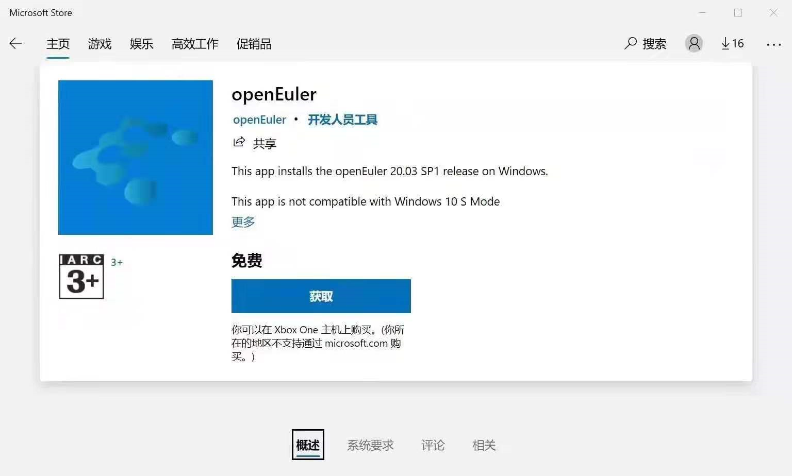

# 如何运行openEuler on WSL

首先您需要5步配置WSL环境，然后您就能在Microsoft Store上安装任意WSL发行版了，包括openEuler！

# 配置WSL环境

这是官方文档，[在 Windows 10 上安装 WSL | Microsoft Docs](https://docs.microsoft.com/zh-cn/windows/wsl/install-win10)，您也可以按照以下步骤来做：

## 1 启动控制台

使用管理员身份打开PoweShell，您可以按下Win+X，点击“**Windows PowerShell (管理员)**”。

请注意，请不要点击“Windows PowerShell”，一定要点击带有(管理员)后缀的，因为这样才能用管理员身份启动。

将下列命令复制粘贴到控制台，然后按回车运行：

## 2 开启WSL服务

```powershell
dism.exe /online /enable-feature /featurename:Microsoft-Windows-Subsystem-Linux /all /norestart
```

## 3 开启虚拟机特性

```shell
dism.exe /online /enable-feature /featurename:VirtualMachinePlatform /all /norestart
```

## 4 重启电脑

请一定要重启，否则无法继续下面的操作。

您可以在浏览器中将该文档网页收藏，方便重启后继续往下操作。

## 5  更新WSL内核

下载[64位的Linux内核升级包](https://wslstorestorage.blob.core.windows.net/wslblob/wsl_update_x64.msi)，双击安装下载好的安装包。

## 6 将WSL2设为默认启动版本

打开控制台，运行以下命令。

```shell
wsl --set-default-version 2
```

# 安装openEuler

经过上述操作后，就可以前往Microsoft Store，安装任意Linux发行版了，这里以openEuler为例。

1. 点击[openEuler在商城的链接](https://www.microsoft.com/store/apps/9NGF0Q0XP03D)，点击获取，允许网页跳转安装。

2. 或者打开Microsoft Store，手动搜索openEuler，如下所示：

默认情况下，您的任务栏应当有下列图标：


如果没有，可以按下Win+Q，输入store，搜索Microsoft store


无论哪种方法，您都会在Microsoft Store上看到openEuler的描述页，如下所示，点击获取，等待安装即可。




# 启动openEuler

安装好后，有以下几种启动方法：

1. 开始菜单中点击图标启动。
2. 命令行启动。
3. VScode中启动。

## 开始菜单中点击图标启动


如图所示，将左侧openEuler小图标拖到右侧变成较大的磁贴，点击磁贴或小图标都能运行。

## 命令行启动

Windows下有三种命令行，PoweShell，cmd，Windows terminal。

推荐使用Windows terminal，其使用更符合linux习惯，而且界面更美观。

下面演示Windows terminal的安装，及打开方式。

1. 打开Microsoft Store，搜索Windows terminal，安装
2. 在开始菜单或Win+Q搜索windows terminal打开Windows terminal
3. 或按下Win+R，输入windows terminal或者其缩写wt，按下回车即可启动

启动上述三种任意命令行后，即可在命令行中输入WSL命令，来启动openEuler。

输入下列命令查看命令行帮助：

```
wsl -h
```

输入以下命令显示当前安装的WSL发行版：

```
wsl -l
```


可以看到我这里安装了openEuler、fedoraremix、Ubuntu，且openEuler是默认启动的发行版。

输入下列命令，可以启动默认的发行版。

```
wsl 
```

如果您在安装openEuler前安装了其他WSL发行版，那么可以运行下列命令将openEuler设为默认启动的发行版。

```
wsl -s openEuler
```

此外，使用-d命令，可以指定启动任意发行版。

```
wsl -d openEuler
```


如上图所示，我使用Windows Terminal启动了WSL的默认发行版，也就是openEuler。


## VScode启动

如果涉及代码编写，推荐使用VScode打开WSL。

VScode可以使用ssh的方式，连接到WSL。其需要在WSL中下载一个安装包，此安装包需要使用tar解包，因此连接的发行版需要安装tar。

1. 使用上面讲的方法，在命令行打开openEuler，安装tar。

   ```
   dnf install tar -y
   ```

2. 在Windows下安装VScode，[官网链接](https://code.visualstudio.com/)。

3. 打开vscode，安装WSL插件。


2. 在远程资源管理器中，在下拉菜单中，选择WSL targets


3. 在菜单中，选择openEuler，即可打开新的窗口启动openEuler

   

4. 在VScode中，按下快捷键Ctrl+~，即可打开控制台

# 启动界面

首次运行需要进行安装，需要稍等一两分钟，如下图所示：


安装好后，界面如下：


# 注意事项

## WSL与VMware、VirtualBox不兼容问题

参见[官方文档](https://docs.microsoft.com/en-us/windows/wsl/wsl2-faq#will-i-be-able-to-run-wsl-2-and-other-3rd-party-virtualization-tools-such-as-vmware--or-virtualbox-)，WSL使用Hyper-V技术来提供虚拟化，而部分老版本的VMware、VirtualBox在Hyper-V技术开启后，无法正常运行。

这意味着您需要更新VMware、VirtualBox到新版本来解决这个问题。

## VScode连接openEuler失败

如果您使用VScode 连接openEUler报错，出现了下图所示的报错，那么您需要在openEulelr中安装tar，才能让VScode连接成功。

请使用命令行启动openEuler，然后运行下列命令来安装tar包。

```shell
dnf install tar -y
```


## 其他问题

如果您安装过程中，出现了其他问题，请参考以下微软文档：

1. [在 Windows 10 上安装 WSL | Microsoft Docs](https://docs.microsoft.com/zh-cn/windows/wsl/install-win10#troubleshooting-installation)
2. [排查适用于 Linux 的 Windows 子系统问题 | Microsoft Docs](https://docs.microsoft.com/zh-cn/windows/wsl/troubleshooting)

此外，微软官方还介绍了更多关于WSL的有用知识，请参考文档：

[适用于 Linux 的 Windows 子系统文档 | Microsoft Docs](https://docs.microsoft.com/zh-cn/windows/wsl/)

## WSL的缺陷

WSL有部分无法支持的原生Linux功能，比如不支持systemctl，正在支持GUI等。

详见[有关适用于 Linux 2 的 Windows 子系统的常见问题 | Microsoft Docs](https://docs.microsoft.com/zh-cn/windows/wsl/wsl2-faq)

# 移植过程

如果您对移植过程感兴趣，可以查看我的[移植过程](./移植过程.md)

