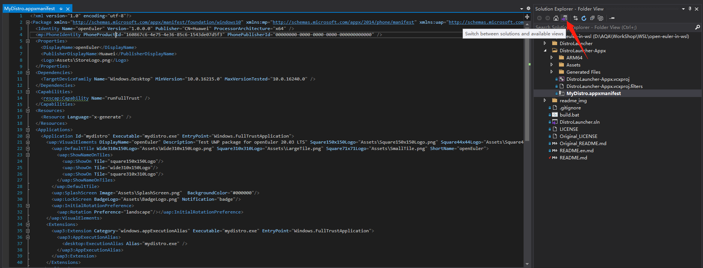
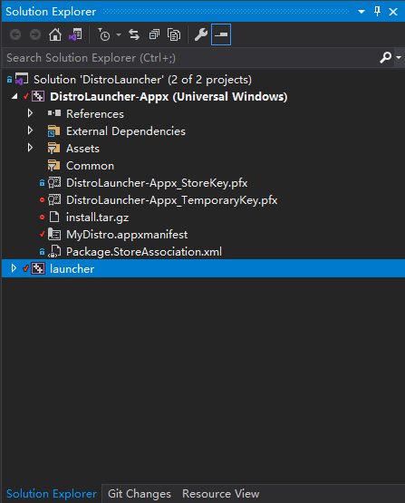
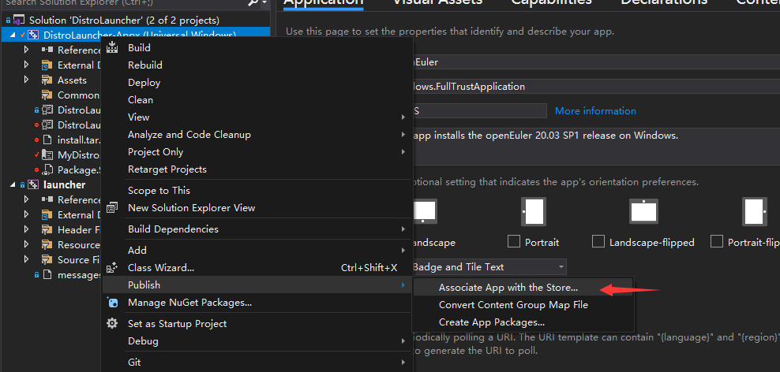
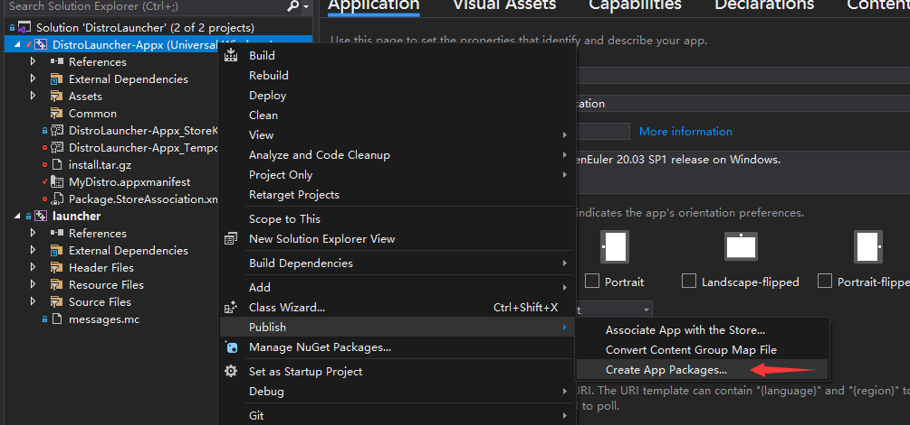
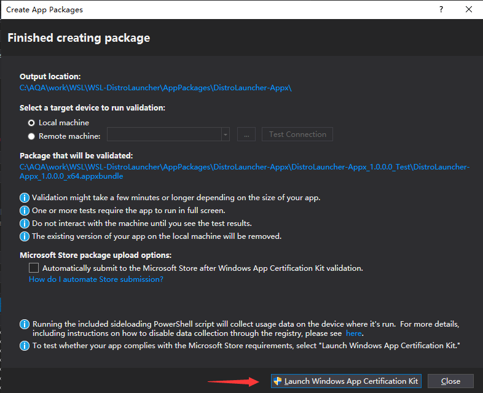
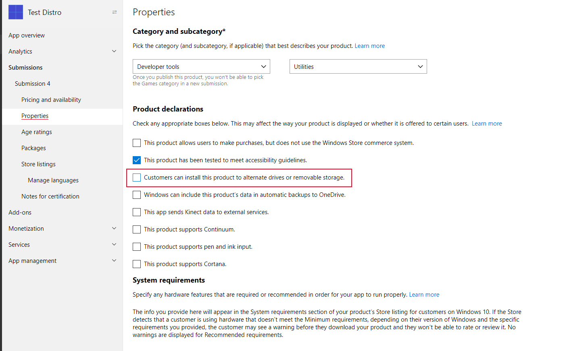

# Porting process

**If you just want to run openEuler, you can stop here and don't need to read more.** 

If you are interested in WSL and the porting process, you can read more.

# About WSL

WSL is similar to Docker in many ways, such as:

1. you can start WSL at about the same speed as starting docker container.
2. All distributions under WSL share the host kernel with containers under Docker.
3. Distributions under WSL share the host kernel, and containers do too.

so I simply understand that WSL is a lightweight virtual machine that is very similar to Docker in practice.

In addition, WSL team has developed a number of unique technologies to implement WSL, see the official blog

[Learn About Windows Console & Windows Subsystem For Linux (WSL) | Windows Command Line (microsoft.com)](https://devblogs.microsoft.com/commandline/learn-about-windows-console-and-windows-subsystem-for-linux-wsl/#deep-dives)

# Manually import openEuler

Refer to official documentation: [Import any Linux distribution to use with WSL | Microsoft Docs](https://docs.microsoft.com/en-us/windows/wsl/use-custom-distro)

1. You need to get a root file system that contains all of openEuler's binaries.
   1. Export the container file system using Docker.
   2. Or use Debootstrap to create a root file system (not tried yet).
2. Import the root file system using the WSL command.

## Export the container file system using Docker

1. Download the Docker image of openEuler LTS SP1，[Link.](https://repo.openEuler.org/openEuler-20.03-LTS-SP1/docker_img/x86_64/openEuler-docker.x86_64.tar.xz) For example, I store it in the D:\Download directory.
2. Open the console, **go to the folder** where you just downloaded the image. Start Ubuntu, and you will find your working directory is still in the same place, which is /mnt/d/Download.

```shell
cd D:\Download
wsl -d Ubuntu
```

3. Install docker under Ubuntu.

```shell
curl -sSL https://get.daocloud.io/docker | sh
```

4. Import the image. -i indicates that the tar package is used to import the image.

```shell
docker load -i .\openEuler-docker.x86_64.tar.xz
```

5. List the current images.

```shell
docker images
```

You should have the following output:

```shell
REPOSITORY                 TAG       IMAGE ID       CREATED         SIZE
openEuler-20.03-lts-sp1    latest    6934cec25f28   3 months ago    512MB
```

6. Run any command to load the container.

```sh
docker run openEuler-20.03-lts-sp1 echo hello, openEuler WSL
```

7. Export a snapshot of the Docker container, which is the current file system.

docker ps -ql means to get the container number of the most recently run container, which is just the container number of openEuler.

```shell
docker export $(docker ps -ql) > ./openEuler.tar
exit
```

## Import the root file system using the WSL command

Quit Ubuntu, use the WSL command in the console to import the openEuler package, meanwhile specify  an openEuler installation directory. 

For example, set D:\work\WSL\ openEuler as the WSL installation directory

```shell
wsl --import openEuler D:\work\WSL\openEuler .\openEuler.tar
```

9. You can start openEuler.

```shell
wsl -d openEuler
```

## Use Debootstrap to export the root file system

Please note that Debootstrap is for Debian operating systems, such as Debian Ubuntu. You can export the root file system for the specified version. 

Febootstrap is for Fedora operating system.

If you don't use a tool like Debootstrap, you can use a script to export the root file system. See the link below for reference:

Fedora：[fedora-wsl-builder.sh · master · Gerard Braad / fedora-wsl · GitLab](https://gitlab.com/gbraad/fedora-wsl/-/blob/master/fedora-wsl-builder.sh)

Kali Linux：[build_chroot.sh · master · Kali Linux / Build-Scripts / kali-wsl-chroot · GitLab](https://gitlab.com/kalilinux/build-scripts/kali-wsl-chroot/-/blob/master/build_chroot.sh)

# Build the installation package process

1. Install WSL and Ubuntu under WSL.

2. Export the root file system.

3. Git clone.

4. Revise basic information.

5. Modify the code.

6. Build packages.

## 1 Install WSL, Ubuntu

There is a detailed description of how to configure WSL and install Ubuntu in [README](./README.en.md), which will not be repeated here.

## 2 Export the root file system

Refer to the "Manually Importing openEuler" section of this document.

The last step should be changed to this, which changes the name of the exported package.

```shell
docker export $(docker ps -ql) > ./install.tar
```

Quit Ubuntu and compress the package.

```shell
exit
gzip.exe -k .\install.tar
```

-k means to keep the package, not delete it.

## 3 Git clone

Clone the official launcher repository.

```shell
git clone https://github.com/Microsoft/WSL-DistroLauncher
```

Install Visual Studio, and choose to install the "Common Windows Platform Development tool", "Desktop development using C++".

For "Common Windows Platform Development", you need to check the Windows 10 SDK (10.0.16299.0), keep the rest of the choices default.

## 4 Modify the basic information

Use Visual Studio to open the **distrolauncher.sln** under the wsl-distrolauncher project.

Double-click to open MyDistro.appxmanifest, and VS will automatically probe the XML format and display a nice screen like this.


You need to modify the following places:

1. Application: Modify the name and description of the Application.
2. Visual Assets: Add a logo for your application display. you can use Asserts Generator to generate images of different sizes. Here I found the openEuler vector image logo, enlarged it a little, and referenced the Ubuntu startup icon, cropped the text part, which only remain the logo, to make the icon look better in the start menu.
3. Packaging: Add application signature. Click the Choose Certificate... , click the Create... , enter any Publish Name and create it.

## 5 Modify the code

1. Modify "My Distribution" to openEuler in Distributionlnfo.h, requiring two changes.

2. Modify DistroLauncher-Appx.vcxproj, find < TargetName> mydistro< TargetName> and change mydistro to openEuler.

3. Open MyDistro.appxmanifest in plain text mode and change all mydistro to openEuler .

   Click the toggle button below to toggle between the solution view and the plain text view. The two modes display different interfaces for MyDistro. AppXManifest.

   

4. Comment code of creating user in distrolauncher.cpp, as shown below

   

## 6 Build packages

Copy the install.tar.gz from step 2 to the x86 directory at the root of the project

Right-click "Solution (DistroLauncher)" in the VS Solution directory and click Deploy Solution.

Wait for the build to complete.

In the Solution Explorer on the right, you can see the following screen.



Right-click "Solution (DistroLauncher)" and click Deploy Solution from the pop-up menu

Wait for the compilation to complete, after the build is complete, you can see openEuler in the start menu.

You can also see the openEuler . exe file under the x64\Debug\DistroLauncher-Appx\AppX folder in the project folder. 

Now you can launch openEuler for testing.

# Release process

## Account application

Sign up a [Microsoft partners](https://partner.microsoft.com/) account.

Note that if you choose to register a company account, you will need to provide the official PDF file of the company registration, and the process of Microsoft verifying the file will be lengthy.

After you have registered your Account and paid, log in, click on the gear in the upper right corner, click on Account Settings, and to the right of Windows Publisher ID, find the code starting with CN.

This CN code is used to uniquely identify your account, and will be used in subsequent packaging.

## associated App

In Visual Studio, associate the project with the name of the App you created.



Follow the wizard, login in your account, select the application name.

## Create signature

Then you need to create a signature, as shown in the figure below:


1. Open distrolauncher.sln and go to the Packaging TAB
2. Click Choose Certificate...
3. Click on the Create...
4. Enter the CN code you just got
5. Click OK to save and create the certificate
6. Click OK to select the newly created certificate

## Create a releasable package

Finally, create a releasable package



Select Publish to Microsoft Store and create.



After compiling and creating, you can choose whether to test or not.

Then you can go to the project directory to find the uploaded file, such as:

WSL-DistroLauncher\AppPackages\DistroLauncher-Appx\DistroLauncher-Appx_1.0.0.0_x64_bundle.appxupload

## Request to publish to Microsoft Store

Go to the Microsoft Partner Center, create the app, and fill in the prompts.

It should be noted that the following options should not be checked, for the following reasons:

[Notes for uploading to the Store · microsoft/WSL-DistroLauncher Wiki · GitHub](https://github.com/Microsoft/WSL-DistroLauncher/wiki/Notes-for-uploading-to-the-Store)



Then submit your application and wait for Microsoft to approve it.

# Notes

If you clone from https://gitee.com/openeuler/wsl, then folder name should change from wsl to WSL-DistroLauncher, otherwise the follow-up may compile failed.
