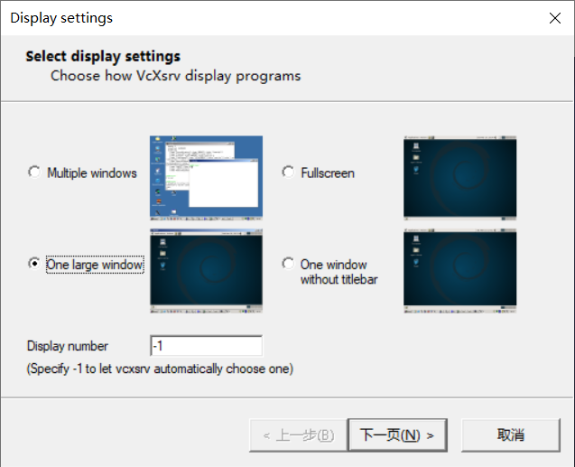
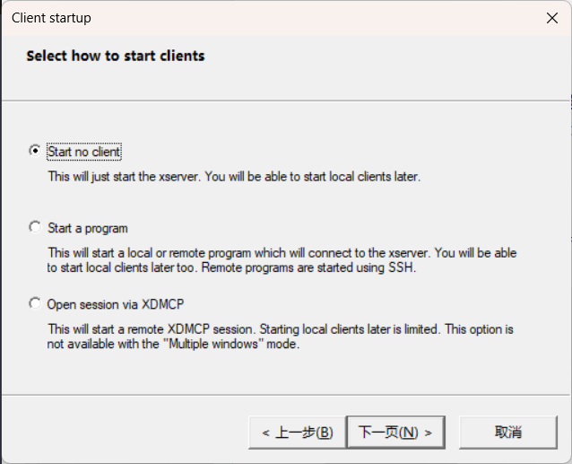
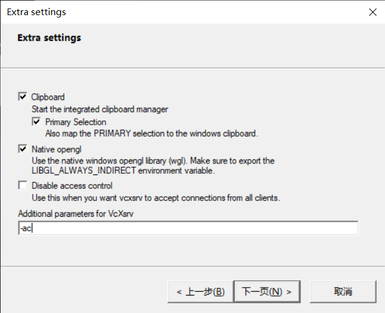
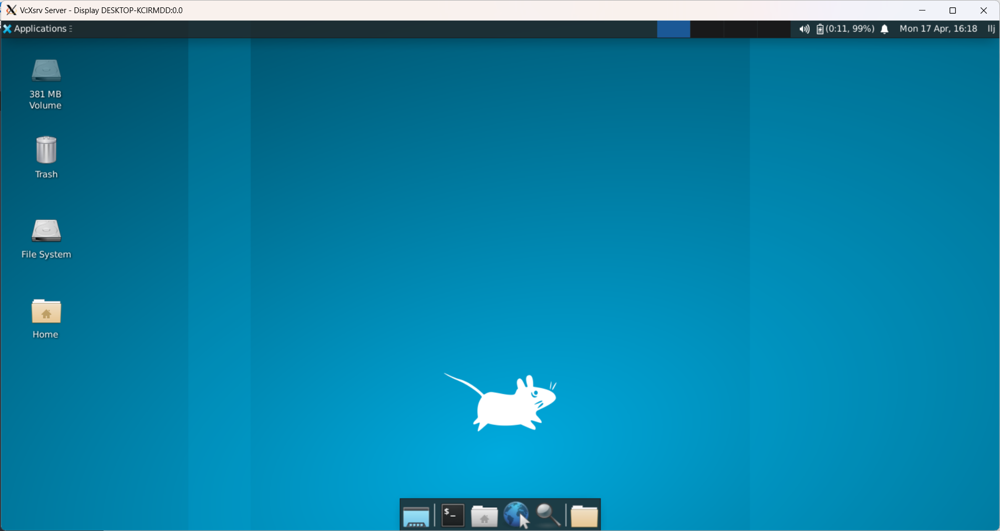
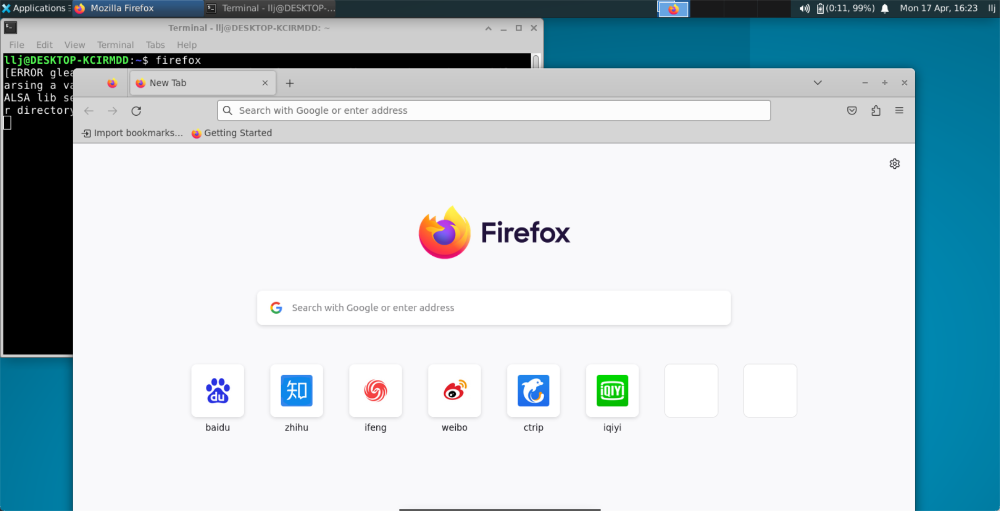
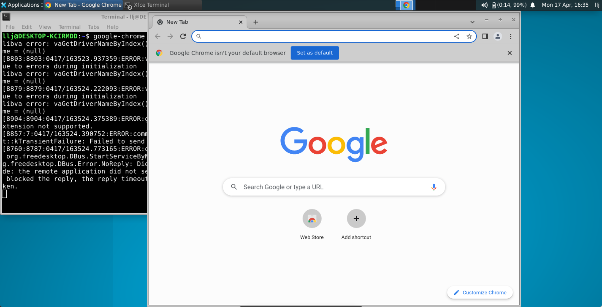
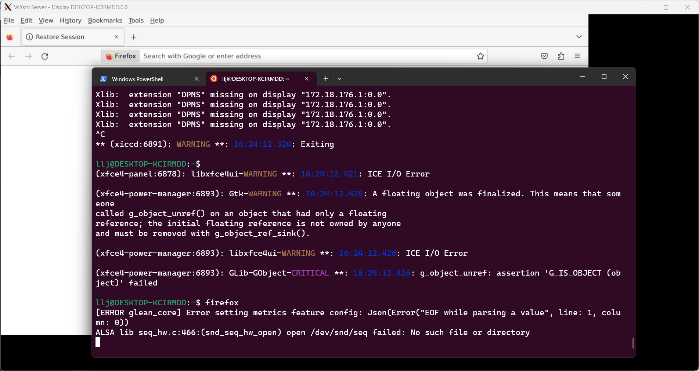

# WSL介绍

## WSL是什么

WSL 是 Windows Subsystem for Linux 的缩写，意思是 Windows 的一个子系统，可以在 Windows 下运行 Linux 操作系统。它的主要目标是提高文件系统性能，以及添加完全的系统调用兼容性。你可以在 Microsoft Store 中选择你偏好的 Linux 分发版，运行常用的命令行工具、服务、语言和图形应用程序。它不需要传统的虚拟机或双启动设置开销。

## WSL与虚拟机的区别

WSL 和虚拟机的区别主要有以下几点：

- WSL 1 是基于动态翻译的方式将 Linux 的系统调用翻译为 Windows NT 的系统调用，而 WSL 2 是基于虚拟机的，在 Windows 主系统之上创建完整的 Linux 内核；
- WSL 的启动时间短，资源占用量少，并且无需 VM 配置或管理，而虚拟机可能启动速度慢，是独立的，消耗大量资源，需要你花费时间进行管理；
- WSL 可以对 Windows 文件系统下的文件直接进行读写，文件传输更方便，而虚拟机需要通过共享文件夹或其他方式来实现文件交换；
- WSL 支持剪贴板互通，可以直接在 Windows 下复制文本内容，粘贴到 WSL，而虚拟机需要安装增强工具或其他插件来实现这一功能；
- WSL 有 Windows 和 Linux 之间的无缝集成，可以跨 OS 调用应用程序，而虚拟机需要在不同的操作系统之间切换；
- WSL 可以在 Microsoft Store 中选择你偏好的 Linux 分发版，而虚拟机可以运行更多的开源操作系统，如 BSDs 或 FreeDOS；
- WSL 支持完全的系统调用兼容性，可以运行更多的 Linux 应用程序，如 Docker 等，而虚拟机可能有一些兼容性问题；
- WSL 的跨 OS 文件系统的性能比虚拟机低，如果要使用 Windows 应用程序来访问 Linux 文件，则目前通过虚拟机可实现更快的性能；
- WSL 不支持访问串行端口或 USB 设备（除非使用 USBIPD-WIN 项目），而虚拟机可以直接连接外部设备；
- WSL 不支持图形界面应用（除非使用一些临时技术来解决它），而虚拟机可以直接显示 Linux 的桌面环境和窗口管理器。

## WSL的优势

WSL 的优势如下：

- 与在虚拟机下使用 Linux 相比，WSL 更加流畅；
WSL 可以对 Windows 文件系统下的文件直接进行读写，文件传输更方便；
- WSL 支持剪贴板互通，可以直接在 Windows 下复制文本内容，粘贴到 WSL；
- WSL 使用的是真正的 Linux 内核，支持完全的系统调用兼容性，可以运行更多的 Linux 应用程序；
- WSL 的启动时间短，资源占用量少，并且无需 VM 配置或管理；
- WSL 的内存使用量会随使用而缩放，并且当进程释放内存时，这会自动返回到 Windows；
- WSL 有 Windows 和 Linux 之间的无缝集成，可以跨 OS 调用应用程序。

## WSL目前支持的Linux分发版

wsl sideload是指在WSL中安装不在Microsoft Store中提供的Linux发行版的过程。有两种方法可以实现wsl sideload：

- 使用tar文件导入任何Linux发行版，例如CentOS。这需要先获取一个包含发行版所有Linux二进制文件的tar文件，然后使用wsl --import命令将其导入WSL。
- 创建自己的自定义Linux发行版，打包为UWP应用，其行为将与Microsoft Store中提供的WSL发行版完全一样。这需要使用Windows 10 SDK中的工具来创建和签名应用包，然后使用Add-AppxPackage命令将其安装到WSL。

## 构建一个sideload

首先在一个 terminal 中依次执行如下命令，从 docker 中导出一个 Linux 发行版容器：

```
docker pull openeuler/openeuler
docker run -t openeuler/openeuler
```

然后在另一个 terminal 中依次执行如下命令，导出openeuler：

```
docker ps
docker export $(docker ps -ql) > ./openeuler.tar
```

然后执行如下指令，使用WSL命令，导入openEuler包，并指明openEuler的安装目录。例如，设置D:\work\WSL\openEuler为WSL的安装目录。：

```
wsl --import openEuler D:\work\WSL\openEuler .\openEuler.tar
wsl -d openEuler
```

即可实现 sideload 方式加载自定义的 wsl

# 在wsl中实现图形化界面

依次输入如下命令：

```
wsl -d Ubuntu
sudo apt update
sudo apt upgrade
```

## 安装 Gedit 

Gedit 是 GNOME 桌面环境的默认文本编辑器。

```
sudo apt install gedit -y
```

## 安装 GIMP

GIMP 是一种免费的开源光栅图形编辑器，用于图像操作和图像编辑、自由形态绘图、不同图像文件格式之间的转码，以及更专业的任务。

```
sudo apt install gimp -y
```

## 安装 Nautilus

Nautilus 也称为 GNOME Files，是 GNOME 桌面的文件管理器。 （类似于 Windows 文件资源管理器）。

```
sudo apt install nautilus -y
```

## 安装 VLC

VLC 是一种免费的开源跨平台多媒体播放器和框架，可播放大多数多媒体文件。

```
sudo apt install vlc -y
```

## 安装 X11 应用

X11 是 Linux 窗口管理系统，这是随它一起提供的各种应用和工具的集合，例如 xclock、xcalc 计算器、用于剪切和粘贴的 xclipboard、用于事件测试的 xev 等。

```
sudo apt install x11-apps -y
```

## 安装适用于 Linux 的 Google Chrome

1. 使用 wget 下载当前最新稳定版 ：`sudo wget https://dl.google.com/linux/direct/google-chrome-stable_current_amd64.deb`
2. 解压：`sudo dpkg -i google-chrome-stable_current_amd64.deb`
3. 修复包：`sudo apt install --fix-broken -y`
4. 配置包：`sudo dpkg -i google-chrome-stable_current_amd64.deb`

之后在命令行中输入 `google-chrome` 即可启动

## 安装适用于 Linux 的 Microsoft Edge

执行下列命令下载：

```
curl https://packages.microsoft.com/keys/microsoft.asc | gpg --dearmor > microsoft.gpg
sudo install -o root -g root -m 644 microsoft.gpg /usr/share/keyrings/
sudo sh -c 'echo "deb [arch=amd64 signed-by=/usr/share/keyrings/microsoft.gpg] https://packages.microsoft.com/repos/edge stable main" > /etc/apt/sources.list.d/microsoft-edge-beta.list'
sudo rm microsoft.gpg
```

安装 Edge：

```
sudo apt update
sudo apt install microsoft-edge-beta
```

然后在命令行中输入 `microsoft-edge` 即可启动。

## 安装适用于 Linux 的 FireFox

首先下载 VcXsrv ，链接：[https://sourceforge.net/projects/vcxsrv/](https://sourceforge.net/projects/vcxsrv/)

VcXsrv 是一个Windows X server，它可以在Windows上运行Linux GUI应用程序。它的工作原理是将Linux GUI应用程序的图形界面通过X11协议传输到Windows上。

然后启动 VcXsrv ：





第三个界面中，可以勾选第三项或者输入 `-ac` ：



打开后会是一个黑色的屏幕，暂时不管。

然后在 ubuntu 中输入命令下载 xfce4 和 firefox ：

```
sudo apt update
sudo apt install xfce4
sudo apt install firefox
```

然后输入 `vim ~/.bashrc` 修改一些配置，在最后添加如下信息：

```
export DISPLAY=$(cat /etc/resolv.conf | grep nameserver | awk '{print $2}'):0
```

由于每次启动 wsl 的 ip 地址都可能会发生变动，因此需要如上命令实现自动获取目前的 wsl 使用的 ip 地址，从而能够实现与 xfce4 连接。

再输入如下命令：

```
source ~/.bashrc
```

那么启动 firefox 浏览器就有如下两种方法：

**方法一**：

在 ubuntu 中输入命令 `startxfce4` ，可能会出现一些问题，解决方法参考：[https://askubuntu.com/questions/1399383/how-to-install-firefox-as-a-traditional-deb-package-without-snap-in-ubuntu-22](https://askubuntu.com/questions/1399383/how-to-install-firefox-as-a-traditional-deb-package-without-snap-in-ubuntu-22) 。

如果没问题，则可以看到如下画面：



然后在 GUI 中找到 terminal ，输入命令 `firefox` ，即可启动 firefox ：



同样可以在这里启动 Chrome 和 Edge：




**方法二**：

可以直接在 ubuntu 中输入 `firefox` ，然后在 xfce4 中就可以看到，但是这种方式显示的 firefox 浏览器并不是完整的，因此还是推荐方法一。



## 总结

要实现在 wsl 中运行 Linux GUI 应用程序，首先是要安装一些包，如 GIMP ，这个包是实现对图像的操作，Nautilus ，这个包则是用于实现文件管理，VLC 则是用于实现音频的播放，Xfce 则是实现 Linux 的窗口管理。

关于在 wsl 实现 GUI 背后的原理，首先需要谈到 X Window System ，来自 Wikipedia。

这是 MIT 与1984年提出的以位图图像显示图形化界面的一套软件规范及协议。像如今一些知名的桌面环境如 GNOME（在GNOME 3.10之后也可以在 Wayland 下运行）便是基于它实现的。

由于X只是工具包及架构规范，本身并无实际参与运作的实体，所以必须有人依据此标准进行开发撰写。如此才有真正可用、可执行的实体，始可称为实现体。

X采用 **C/S** 的架构模型，由一个X服务器与多个X客户端程序进行通讯，服务器接受对于图形输出（窗口）的请求并反馈用户输入（键盘、鼠标、触摸屏），服务器可能是一个能显示到其他显示系统的应用程序，也可能是控制某个PC的视频输出的系统程序，也可能是个特殊硬件。

X的一大特点在于 “**网络透明性**”：应用程序（“客户端”应用程序）所执行的机器，不一定是用户本地的机器（显示的“服务器”）。X中所提及的“客户端”和“服务器”等字眼用词也经常与人们一般想定的相反，“服务器”反而是在用户本地端的自有机器上执行，而非是在远程的另一部机器上执行。

服务器和客户端之间的通信协议的运作对计算机网络是透明的：客户端和服务器可以在同一台计算机上，也可以不是，或许其架构和操作系统也不同，但都能运行。客户机和服务器还能够使用安全连接在互联网上安全地通讯。

为了使远端客户程序显示到本地服务器，用户一般需要启动一个终端窗口和到达远端计算机的telnet或者ssh，令其显示到用户计算机，（例如：在运行bash的远端计算机上export DISPLAY=[用户的计算机]:0）然后启动客户端。然后客户端就会连接到本地计算机，并且远端应用程序会显示到本地屏幕并被本地输入设备所控制。与之对应，本地计算机上也可以执行一个连接到远端计算机的小型代理程序，并在该端启动与执行自有需求与指定的应用程序。

因此之前在 wsl Ubuntu 中安装 VcXsrv 之后，需要输入 `export DISPLAY=$(cat /etc/resolv.conf | grep nameserver | awk '{print $2}'):0` 这一段命令，由于是在 wsl 中运行的 Ubuntu ，因此其对应的 ip 地址是 wsl 中的地址，而不是本机的 ip 地址。

而对于 Xfce ，为了管理众多的窗口怎么在屏幕上显示，需要窗口管理器(Window manager)。窗口管理器可以实现一个屏幕上显示多个X程序，实现调整程序大小，标题栏，最大化，最小化，关闭按钮，虚拟桌面这些功能。没有WM，一次只能运行一个GUI程序，而且分辨率锁死，显然很不符合使用习惯。为了实现窗口之间的特效，还需要窗口合成器。窗口合成器可以制造半透明之类的特效。

