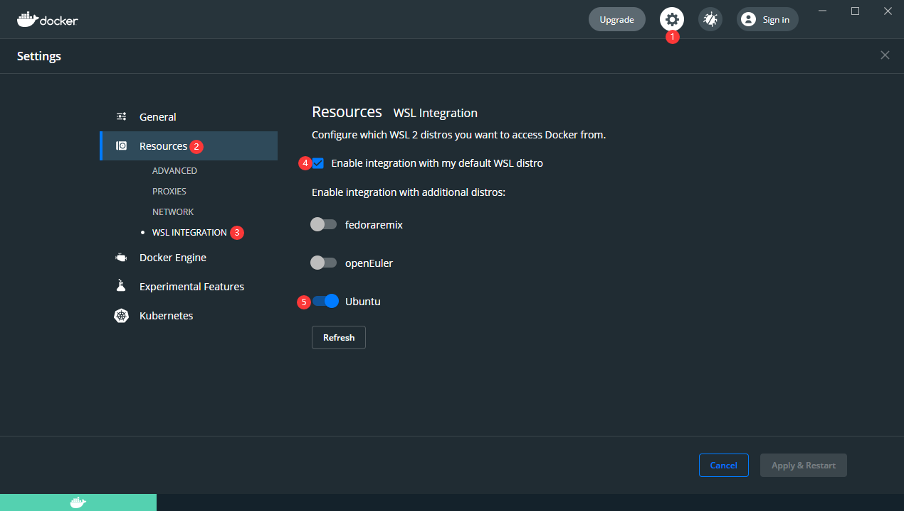

# 移植过程

**如果您只想运行 openEuler，那么可以到此为止了，不用往下看了。**

如果您对 WSL 以及移植过程感兴趣，您可以接着往下看。

# 浅谈WSL原理

WSL很多地方与docker很像，如：

1. 启动 WSL 的速度与启动 docker 容器速度差不多。
2. 导入导出方式，都是用 export，import 命令。
3. WSL 下的各个发行版，与 docker下的容器，都共享宿主机的内核。

因此我简单的理解为，WSL 就是一个，使用起来和 docker 很像的，轻量化的虚拟机。

除此以外，Windows 也开发了很多独有技术来实现 WSL，参见官方博客：

[Learn About Windows Console & Windows Subsystem For Linux (WSL) | Windows Command Line (microsoft.com)](https://devblogs.microsoft.com/commandline/learn-about-windows-console-and-windows-subsystem-for-linux-wsl/#deep-dives)

# 手动导入openEuler

参考官方文档：[导入要用于 WSL 的任何 Linux 分发版 | Microsoft Docs](https://docs.microsoft.com/zh-cn/windows/wsl/use-custom-distro)

您可以导入任何Linux发行版到WSL内：

1. 您需要获得一个根文件系统，包含 openEuler 的所有二进制文件。
   1. 使用docker导出容器文件系统。
   2. 或者使用类似 debootstrap 的工具制作根文件系统。
2. 使用WSL命令导入根文件系统。

## 使用docker导出容器文件系统

### 安装docker

1. 安装 WSL，安装 WSL 下任意发行版，这里以 Ubuntu 为例
2. 安装docker desktop，[链接](https://www.docker.com/products/docker-desktop)，选择安装 WSL 相关组件
3. 在 docker 中开启对应的选项



此时对应的 WSL 发行版中应该有 docker 命令了，如果没有，请参考 docker [wsl官方文档](https://docs.docker.com/desktop/windows/wsl/)配置 

### 导出根文件系统

启动装有 docker 的WSL

直接运行仓库下的脚本

```bash
git clone https://gitee.com/openeuler/wsl.git
cd wsl
sudo ./generate_rootfs.sh
```

这将生成一个 openEuler 最新可用的长期稳定镜像的根文件系统，打包压缩为 install.tar.gz。

参考[openeuler-docker-images: Dockerfiles for openEuler official basic and application images. - Gitee.com](https://gitee.com/openeuler/openeuler-docker-images/tree/master)

你可以修改 docker/dockerfile 中的第一行的标签为如下选项，来生成不同版本的根文件系统。

- 当前可用Tags的命名:
  - [20.09](https://repo.openeuler.org/openEuler-20.09/docker_img/)
  - [20.03-lts](https://repo.openeuler.org/openEuler-20.03-LTS/)
  - [20.03-lts-sp1, 20.03, latest](https://repo.openeuler.org/openEuler-20.03-LTS-SP1/docker_img/)
  - [20.03-lts-sp2](https://repo.openeuler.org/openEuler-20.03-LTS-SP2/docker_img/)
  - [21.03](https://repo.openeuler.org/openEuler-21.03/docker_img/)

请注意，这里我对官方镜像做出了如下修改：

```dockerfile
COPY README README.en /root/
RUN dnf in shadow passwd sudo tar -y
RUN sed -i '/TMOUT=300/d' /etc/bashrc
```

主要是安装了几个包，以及取消了TMOUT的设定，详细见[文档](./docker/README)

1. 下载 openEuler 的docker镜像，这里以 20.03 SP1 为例：[下载链接](https://repo.openeuler.org/openEuler-20.03-LTS-SP1/docker_img/x86_64/openEuler-docker.x86_64.tar.xz)，这里将其存放在D:\Download目录下。
2. 打开控制台，**进入刚刚下载镜像的文件夹**，启动Ubuntu（如果使用 Windows Terminal，可以直接右键点击，然后点击”在 Windows 终端中打开“）

## 使用WSL命令导入根文件系统

退出Ubuntu，在控制台使用WSL命令，导入openEuler包，并指明openEuler的安装目录。

举例，设置D:\work\WSL\openEuler为WSL的安装目录。

```shell
wsl --import openEuler D:\work\WSL\openEuler .\openEuler.tar
```

9. 即可启动openEuler。

```shell
wsl -d openEuler
```

## 使用debootstrap导出根文件系统

请注意，debootstrap适用于Debian系操作系统，如Debian、Ubuntu，可以导出指定版本的根文件系统。

febootstrap适用于Fedora操作系统。

如果不使用debootstrap这类工具，可以使用脚本导出根文件系统，下面给出参考链接：

Fedora：[fedora-wsl-builder.sh · master · Gerard Braad / fedora-wsl · GitLab](https://gitlab.com/gbraad/fedora-wsl/-/blob/master/fedora-wsl-builder.sh)

Kali Linux：[build_chroot.sh · master · Kali Linux / Build-Scripts / kali-wsl-chroot · GitLab](https://gitlab.com/kalilinux/build-scripts/kali-wsl-chroot/-/blob/master/build_chroot.sh)

# 构建安装包过程
## 1 安装WSL、Ubuntu

在[README](./README.md)中有详细讲述如何配置WSL与安装Ubuntu，这里不再赘述。

## 2 导出根文件系统

参考本文档”手动导入openEuler“小节。

## 3 克隆

克隆官方启动器仓库。

```shell
git clone https://github.com/Microsoft/WSL-DistroLauncher
```

安装Visual Studio，选择安装“通用Windows平台开发”、“使用C++的桌面开发”工具。

对于“通用Windows平台开发”，需要勾选Windows 10 SDK (10.0.16299.0)，其余默认即可。

## 4 修改基本信息

使用Visual Studio打开WSL-DistroLauncher工程下的**DistroLauncher.sln。**

双击打开MyDistro.appxmanifest，此时VS会自动探测xml格式，并出现很好看的修改界面如下。


您需要修改以下几个地方：

1. Application：修改应用名称、描述。
2. Visual Assets：添加应用展示的logo，可以使用Asserts Generator，生成不同大小的图片。这里我找到了openEuler的矢量图logo，放大了些，并参考Ubuntu启动图标，裁剪了文字部分，只保留了logo，让图标在开始菜单好看一些。
3. Packaging：添加应用签名。点击Choose Certificate...，点击Create...，随意输入Publish Name，创建即可。

## 5 构建包

将第2步得到的install.tar.gz复制到项目的根目录下的x86目录。

使用Visual Studio打开WSL-DistroLauncher工程下的DistroLauncher.sln。

在右侧的Solution Explorer，可以看到以下界面。


右键点击"Solution (DistroLauncher)"，在弹出菜单中点击Deploy Solution。

等待编译完成后，则构建完成，这时应该会在开始菜单安装好测试用的openEuler版本。

此外还可以在项目文件夹下的，x64\Debug\DistroLauncher-Appx\AppX文件夹下看到openEuler.exe文件。

现在您可以启动openEuler来进行测试了。

# 发布流程

## 账号申请

登录[微软合作伙伴](https://partner.microsoft.com/)账户，注册一个账户

注意，如果选择注册公司账户，需要提供公司注册的官方PDF文件，且微软验证文件的过程将十分漫长。

注册好账户，付款后，登录账户，点击右上角齿轮，点击Account settings，在Windows publisher ID右侧，找到CN开头的码。

这个CN码是用于唯一标识您的账号的，后续打包时要用到。

## 关联App

在Visual Studio中，将项目与创建的APP名称关联。


后续跟着提示，登录账号，选择应用名称即可。

## 创建签名

然后需要创建签名，如下图所示：


1. 打开DistroLauncher.sln，进入Packaging选项卡
2. 点击Choose Certificate...
3. 点击Create...
4. 输入刚才获得的CN码
5. OK保存，创建证书
6. OK保存，选择刚刚创建好的证书

## 创建可发布的软件包

最后，创建可发布的软件包


选择发布到Microsoft Store上，然后创建即可。


编译创建完后，可以选择是否进行测试。

然后可以到项目目录下的找到上传文件，如：

WSL-DistroLauncher\AppPackages\DistroLauncher-Appx\DistroLauncher-Appx_1.0.0.0_x64_bundle.appxupload

## 申请发布到Microsoft Store

去微软合作伙伴中心，创建应用，按照提示填写内容。

这里需要注意，不得勾选下列选项，原因为：[Notes for uploading to the Store · microsoft/WSL-DistroLauncher Wiki · GitHub](https://github.com/Microsoft/WSL-DistroLauncher/wiki/Notes-for-uploading-to-the-Store)


然后提交申请，等待微软审核后，就能发布了。